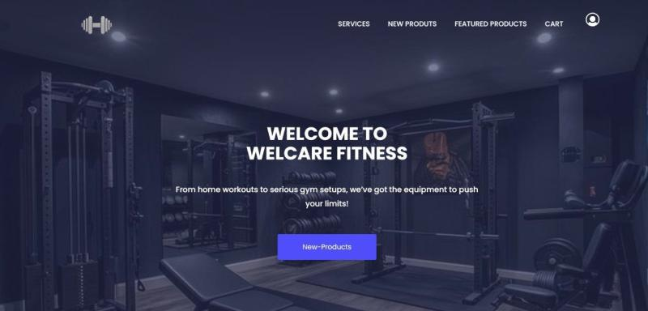
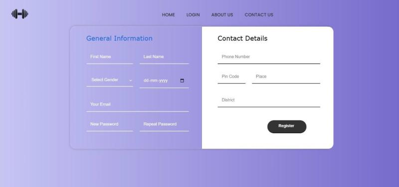
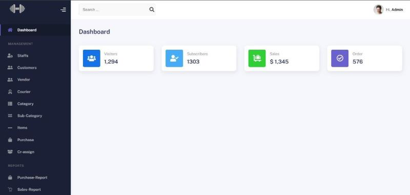
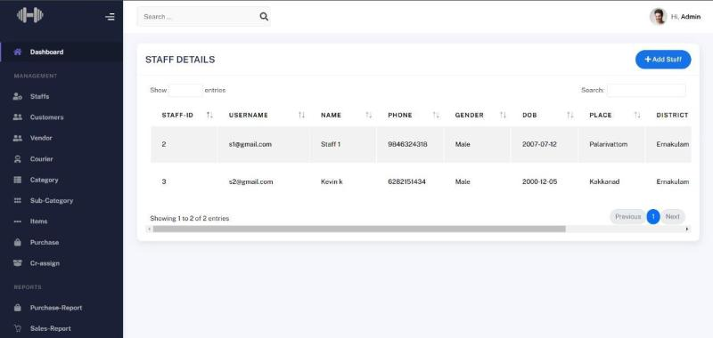

Welcare Fitness - Gym Equipment E-Commerce Website

A fully functional responsive e-commerce website for gym enthusiasts, WelCare Fitness, using Core PHP and MySQL for the back-end, and HTML, CSS, and Bootstrap for the front-end. The platform catered to three user roles: customers, admins, and couriers, each with tailored functionalities. Customers could browse a wide range of gym equipment, place orders, and track deliveries in real-time. Admins had access to a centralized dashboard to manage inventory, staff, and sales analytics, while couriers used a dedicated portal to update delivery statuses and communicate with admins.

The front-end, built with HTML, CSS, and Bootstrap, provided a clean, modern, and responsive interface, ensuring a seamless experience across devices. The back-end, powered by Core PHP and MySQL, handled critical functionalities like user authentication, order processing, and data storage.Implemented robust security measures, such as password hashing and input validation, to protect user data and prevent vulnerabilities like SQL injection.

